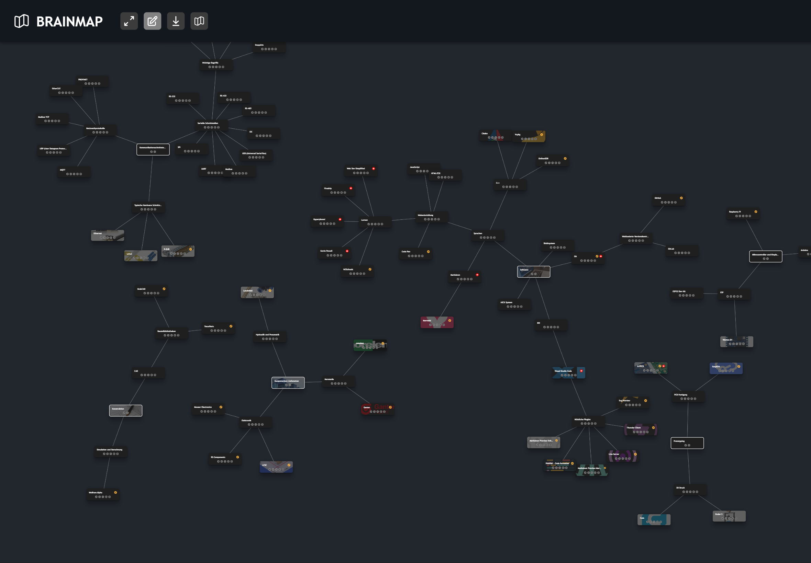

# About the App 📱

A web-based mind-mapping tool with specialized node extensions like toggleable descriptions, general links, and YouTube links. Compatible with all modern browsers.

- [Go to Open Brain Map](https://mgiesen.github.io/Open-Brain-Map/)
- Open Maps From: URL or Local Storage
- Save: Download Map to Local Drive

## Screenshot

## Concept and Motivation 🔨

Crafted as a personal hobby project, `Open-Brain-Map` aims to document and visualize knowledge networks. The primary focus lies in the semantic linkage of information, enhancing topic categorization and providing a comprehensive overview of complex subjects.

The tool also embraces the significance of YouTube as a learning platform, allowing each node to be supplemented with a relevant YouTube link. With the general link you can refer to any kind of ressource you want to provide to the viewer.

## Community Brainmaps 🤝

- [GitHub/mgiesen](https://github.com/mgiesen/Brainmaps)

## How can I contribute? 💁🏼

- Deploy your own and interesting Brainmaps to a public location, to share your ideas/ knowlege or different topics with the community
- Report bugs and ideas for software improvement
- Tell your friends about the project
